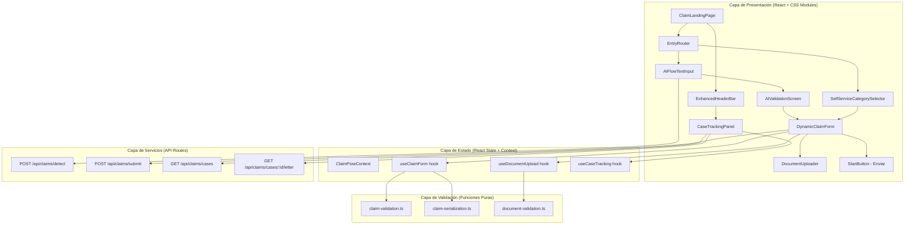
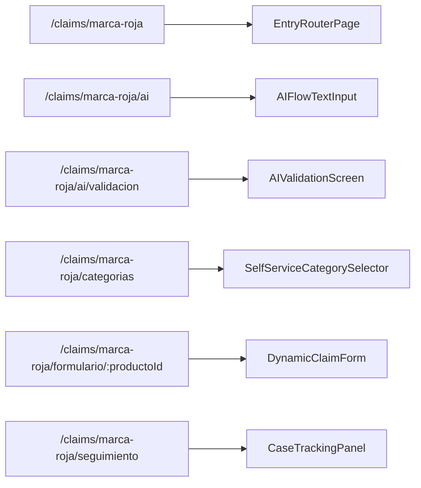

# Diseño Técnico — Aviso Marca Roja

## Resumen

Este documento describe el diseño técnico de la aplicación "Aviso Marca Roja", un sistema de radicación de siniestros para Davivienda que centraliza cuatro productos de seguros (Deudores Davivienda, Protección de Pagos, Mascotas y Bicicletas) en una única plataforma web responsiva. La aplicación extiende los componentes existentes en `src/components/ClaimLanding/` y añade dos flujos principales: uno asistido por IA (donde el usuario describe su situación en texto libre) y otro de autoservicio (selección manual de categoría). Ambos flujos convergen en un formulario dinámico por producto, un cargador de documentos y un panel de seguimiento de casos.

---

## Arquitectura

### Diagrama de Arquitectura General



### Decisiones Arquitectónicas

1. **Extensión, no reemplazo**: Los componentes existentes (`HeaderBar`, `ActionCard`, `BackLink`, `StartButton`, `InfoBanner`) se reutilizan o extienden. No se modifican sus interfaces actuales.
2. **Enrutamiento con react-router-dom**: Se mantiene el patrón existente del proyecto. Se añaden rutas anidadas bajo `/claims/marca-roja/`.
3. **Estado local + Context**: Se usa `React.Context` para compartir el estado del flujo (producto seleccionado, modo de entrada) entre pantallas. Los formularios usan estado local con hooks personalizados.
4. **Funciones puras de validación**: Siguiendo el patrón de `vida-cotizar-validation.ts` y `validation.ts`, toda la lógica de validación y serialización se extrae en módulos puros para facilitar testing con property-based tests.
5. **CSS Modules con variables CSS**: Se extienden los design tokens existentes en `constants.ts` y se usan CSS custom properties para mantener consistencia visual.
6. **API Routes de Next.js**: Los endpoints del backend siguen el patrón existente en `app/api/`, con validación de entrada y respuestas tipadas.

---

## Componentes e Interfaces

### 1. EnhancedHeaderBar (Extensión de HeaderBar)

Extiende el `HeaderBar` existente añadiendo botones de "Ayuda" y "Seguir mi caso" alineados a la derecha.

```typescript
// src/components/ClaimMarcaRoja/EnhancedHeaderBar.tsx
export interface EnhancedHeaderBarProps {
  logoSrc: string;
  logoAlt: string;
  onHelpClick?: () => void;
  onTrackCaseClick?: () => void;
  showHelpLink?: boolean;
  showTrackCaseLink?: boolean;
}
```

**Estrategia**: Composición sobre herencia. `EnhancedHeaderBar` renderiza internamente la franja roja y el logo (mismo patrón que `HeaderBar`) y añade los enlaces a la derecha. Mantiene compatibilidad con las props `logoSrc` y `logoAlt`.

### 2. EntryRouterPage (Pantalla de Entrada)

Pantalla principal que presenta las dos opciones de flujo como tarjetas.

```typescript
// src/components/ClaimMarcaRoja/EntryRouterPage.tsx
export interface EntryRouterPageProps {
  onSelectAIFlow: () => void;
  onSelectSelfServiceFlow: () => void;
}
```

Reutiliza el componente `ActionCard` existente para las dos tarjetas de flujo, aplicando el border-radius de 25px mediante CSS Modules.

### 3. AIFlowTextInput (Entrada de Texto IA)

Pantalla con área de texto libre donde el usuario describe su situación.

```typescript
// src/components/ClaimMarcaRoja/AIFlowTextInput.tsx
export interface AIFlowTextInputProps {
  onSubmit: (text: string) => void;
  onBack: () => void;
  isLoading: boolean;
  error: AIDetectionError | null;
  onRetry: () => void;
  onSwitchToManual: () => void;
}

export interface AIDetectionError {
  type: 'no_match' | 'network' | 'server';
  message: string;
}
```

### 4. AIValidationScreen (Pantalla de Validación IA)

Muestra el producto detectado y permite confirmar o rechazar.

```typescript
// src/components/ClaimMarcaRoja/AIValidationScreen.tsx
export interface AIValidationScreenProps {
  detectedProduct: ProductoSeguro;
  confidenceMessage: string;
  onConfirm: () => void;
  onReject: () => void;
  onBack: () => void;
}
```

### 5. SelfServiceCategorySelector (Selector de Categoría)

Presenta las categorías de producto como tarjetas seleccionables.

```typescript
// src/components/ClaimMarcaRoja/SelfServiceCategorySelector.tsx
export interface SelfServiceCategorySelectorProps {
  categories: ProductoSeguroConfig[];
  onSelectCategory: (productId: ProductoSeguro) => void;
  onBack: () => void;
}
```

### 6. DynamicClaimForm (Formulario Dinámico)

Formulario que ajusta sus campos según el producto seleccionado.

```typescript
// src/components/ClaimMarcaRoja/DynamicClaimForm.tsx
export interface DynamicClaimFormProps {
  product: ProductoSeguro;
  onSubmit: (data: ClaimFormData) => void;
  onBack: () => void;
  isSubmitting: boolean;
}
```

### 7. DocumentUploader (Cargador de Documentos)

Componente de carga de archivos con drag & drop, validación de tamaño y barra de progreso.

```typescript
// src/components/ClaimMarcaRoja/DocumentUploader.tsx
export interface DocumentUploaderProps {
  files: UploadedFile[];
  onAddFiles: (files: File[]) => void;
  onRemoveFile: (fileId: string) => void;
  maxFileSizeMB: number;
  acceptedTypes?: string[];
}

export interface UploadedFile {
  id: string;
  name: string;
  size: number;
  status: 'uploading' | 'complete' | 'error';
  progress: number; // 0-100
  errorMessage?: string;
}
```

### 8. CaseTrackingPanel (Panel de Seguimiento)

Panel donde el usuario consulta el estado de sus casos y descarga cartas.

```typescript
// src/components/ClaimMarcaRoja/CaseTrackingPanel.tsx
export interface CaseTrackingPanelProps {
  cases: CaseInfo[];
  isLoading: boolean;
  error: string | null;
  onDownloadLetter: (caseId: string) => void;
  onBack: () => void;
}
```

### 9. ClaimFlowContext (Contexto de Flujo)

Contexto React que comparte el estado del flujo entre pantallas.

```typescript
// src/components/ClaimMarcaRoja/ClaimFlowContext.tsx
export interface ClaimFlowState {
  flowType: 'ai' | 'self-service' | null;
  selectedProduct: ProductoSeguro | null;
  aiInputText: string;
  step: ClaimFlowStep;
}

export type ClaimFlowStep =
  | 'entry'
  | 'ai-input'
  | 'ai-validation'
  | 'category-selection'
  | 'form'
  | 'tracking';

export interface ClaimFlowContextValue {
  state: ClaimFlowState;
  setFlowType: (type: 'ai' | 'self-service') => void;
  setSelectedProduct: (product: ProductoSeguro) => void;
  setAiInputText: (text: string) => void;
  setStep: (step: ClaimFlowStep) => void;
  reset: () => void;
}
```

### 10. Hooks Personalizados

```typescript
// src/components/ClaimMarcaRoja/hooks/useClaimForm.ts
export function useClaimForm(product: ProductoSeguro): {
  formData: ClaimFormData;
  errors: ClaimFormErrors;
  updateField: (field: string, value: unknown) => void;
  validate: () => boolean;
  serialize: () => string;
  isValid: boolean;
};

// src/components/ClaimMarcaRoja/hooks/useDocumentUpload.ts
export function useDocumentUpload(maxSizeMB: number): {
  files: UploadedFile[];
  addFiles: (files: File[]) => void;
  removeFile: (fileId: string) => void;
  hasErrors: boolean;
  totalSize: number;
};

// src/components/ClaimMarcaRoja/hooks/useCaseTracking.ts
export function useCaseTracking(): {
  cases: CaseInfo[];
  isLoading: boolean;
  error: string | null;
  refresh: () => void;
  downloadLetter: (caseId: string) => Promise<void>;
};

// src/components/ClaimMarcaRoja/hooks/useAIDetection.ts
export function useAIDetection(): {
  detect: (text: string) => Promise<void>;
  result: AIDetectionResult | null;
  isLoading: boolean;
  error: AIDetectionError | null;
  reset: () => void;
};
```

---

## Modelos de Datos

### Tipos Centrales

```typescript
// src/components/ClaimMarcaRoja/types.ts

/** Productos de seguro disponibles en Marca Roja */
export type ProductoSeguro =
  | 'deudores-davivienda'
  | 'proteccion-pagos'
  | 'mascotas'
  | 'bicicletas';

/** Configuración de un producto de seguro para el UI */
export interface ProductoSeguroConfig {
  id: ProductoSeguro;
  nombre: string;
  descripcion: string;
  iconSrc: string;
  iconAlt: string;
  campos: CampoFormulario[];
  documentosRequeridos: string[];
}

/** Tipos de documento de identidad */
export type TipoDocumento = 'CC' | 'CE' | 'TI' | 'PA' | 'NIT';

/** Datos del titular del seguro */
export interface DatosTitular {
  tipoDocumento: TipoDocumento;
  numeroDocumento: string;
}

/** Definición de un campo del formulario dinámico */
export interface CampoFormulario {
  id: string;
  label: string;
  type: 'text' | 'select' | 'date' | 'number' | 'textarea';
  required: boolean;
  placeholder?: string;
  options?: { value: string; label: string }[];
  validation?: CampoValidationRule;
}

/** Regla de validación para un campo */
export interface CampoValidationRule {
  minLength?: number;
  maxLength?: number;
  pattern?: string;
  patternMessage?: string;
  min?: number;
  max?: number;
}

/** Datos del formulario de reclamación */
export interface ClaimFormData {
  producto: ProductoSeguro;
  titular: DatosTitular;
  campos: Record<string, unknown>;
  documentos: UploadedFileRef[];
}

/** Referencia a un archivo subido */
export interface UploadedFileRef {
  id: string;
  name: string;
  size: number;
}

/** Errores de validación del formulario */
export type ClaimFormErrors = Partial<Record<string, string>>;

/** Resultado de la detección IA */
export interface AIDetectionResult {
  producto: ProductoSeguro;
  confianza: number; // 0-1
  mensaje: string;
}

/** Estados posibles de un caso */
export type EstadoCaso = 'en-analisis' | 'pendiente-documentos' | 'anulado' | 'cerrado';

/** Información de un caso de siniestro */
export interface CaseInfo {
  id: string;
  producto: ProductoSeguro;
  productoNombre: string;
  estado: EstadoCaso;
  fechaRadicacion: string; // ISO 8601
  razonEstado?: string;
  tieneCartaDefinicion: boolean;
}

/** Mapeo de estado a etiqueta visible */
export const ESTADO_CASO_LABELS: Record<EstadoCaso, string> = {
  'en-analisis': 'En análisis',
  'pendiente-documentos': 'Pendiente documentos',
  'anulado': 'Anulado',
  'cerrado': 'Cerrado',
};
```

### Tipos de API

```typescript
// src/components/ClaimMarcaRoja/api-types.ts

/** Request para el endpoint de detección IA */
export interface DetectProductRequest {
  texto: string;
}

/** Response del endpoint de detección IA */
export interface DetectProductResponse {
  producto: ProductoSeguro;
  confianza: number;
  mensaje: string;
}

/** Request para enviar una reclamación */
export interface SubmitClaimRequest {
  producto: ProductoSeguro;
  titular: DatosTitular;
  campos: Record<string, unknown>;
  documentos: UploadedFileRef[];
}

/** Response de envío exitoso */
export interface SubmitClaimResponse {
  caseId: string;
  mensaje: string;
  estado: EstadoCaso;
}

/** Response de error de la API */
export interface ClaimApiError {
  error: string;
  mensaje: string;
  detalles?: { campo: string; mensaje: string }[];
}
```

### Extensión de Design Tokens

```typescript
// Extensión en src/components/ClaimLanding/constants.ts
// Se añaden tokens sin romper los existentes

export const MARCA_ROJA_TOKENS = {
  colors: {
    ...DESIGN_TOKENS.colors,
    accent: '#ED1C24',       // Rojo Davivienda (alias explícito)
    success: '#28A745',
    warning: '#FFC107',
    error: '#DC3545',
    backgroundWhite: '#FFFFFF',
  },
  borderRadius: {
    card: '25px',
    button: '25px',
    input: '12px',
  },
  spacing: {
    xs: '4px',
    sm: '8px',
    md: '16px',
    lg: '24px',
    xl: '32px',
  },
} as const;
```

### Estructura de Rutas

```typescript
// Extensión de ROUTES en constants.ts
export const MARCA_ROJA_ROUTES = {
  entry: '/claims/marca-roja',
  aiInput: '/claims/marca-roja/ai',
  aiValidation: '/claims/marca-roja/ai/validacion',
  categorySelect: '/claims/marca-roja/categorias',
  form: '/claims/marca-roja/formulario/:productoId',
  tracking: '/claims/marca-roja/seguimiento',
  help: '/claims/marca-roja/ayuda',
} as const;
```

### Configuración de Rutas (react-router-dom)



Todas las rutas se envuelven en un `ClaimFlowProvider` que provee el contexto compartido.

---

## Integración con API

### Endpoints

| Método | Ruta | Descripción | Request | Response |
|--------|------|-------------|---------|----------|
| POST | `/api/claims/detect` | Detección IA de producto | `DetectProductRequest` | `DetectProductResponse` |
| POST | `/api/claims/submit` | Envío de reclamación | `SubmitClaimRequest` | `SubmitClaimResponse` |
| GET | `/api/claims/cases` | Lista de casos del usuario | — | `CaseInfo[]` |
| GET | `/api/claims/cases/:id/letter` | Descarga carta PDF | — | `Blob (application/pdf)` |

### Patrón de Integración

Siguiendo el patrón existente en `app/api/ai/chat/route.ts`:

```typescript
// app/api/claims/detect/route.ts
export async function POST(request: Request): Promise<NextResponse> {
  const body = await request.json();
  // 1. Validar entrada
  // 2. Llamar al Motor de Detección (mock en desarrollo)
  // 3. Retornar resultado tipado
}
```

El Motor de Detección se implementa como un módulo separado (`app/lib/claim-detection.ts`) con una interfaz clara que permite sustituir la implementación mock por una real sin cambiar los consumidores.

---

## Validación y Serialización (Funciones Puras)

### claim-validation.ts

Siguiendo el patrón de `vida-cotizar-validation.ts`, se extraen funciones puras:

```typescript
// src/lib/claim-validation.ts

export function validarDatosTitular(datos: unknown): ResultadoValidacion;
export function validarCamposProducto(
  producto: ProductoSeguro,
  campos: Record<string, unknown>
): ResultadoValidacion;
export function validarFormularioCompleto(data: unknown): ResultadoValidacion;
export function sanitizarTexto(input: string): string;
```

### claim-serialization.ts

```typescript
// src/lib/claim-serialization.ts

export function serializarFormulario(data: ClaimFormData): string;
export function deserializarFormulario(json: string): ClaimFormData;
```

### document-validation.ts

```typescript
// src/lib/document-validation.ts

export function validarArchivo(file: File, maxSizeMB: number): {
  valido: boolean;
  error?: string;
};
export function validarListaArchivos(
  files: File[],
  maxSizeMB: number
): { valido: boolean; errores: string[] };
```

---

## Estrategia de CSS Modules

### Convenciones

- Cada componente nuevo tiene su propio archivo `.module.css` (ej: `EnhancedHeaderBar.module.css`).
- Se usan CSS custom properties (`var(--color-primary)`) para los design tokens, con fallbacks.
- El border-radius de 25px se aplica mediante la variable `var(--border-radius-card, 25px)`.
- Los breakpoints siguen el patrón existente: `@media (max-width: 767px)` para móvil.

### Ejemplo de Extensión

```css
/* EnhancedHeaderBar.module.css */
.header {
  width: 100%;
}

.logoBar {
  display: flex;
  align-items: center;
  justify-content: space-between;
  padding: 12px 24px;
  background-color: var(--color-white, #FFFFFF);
  border-bottom: 1px solid var(--color-border, #E0E0E0);
}

.navLinks {
  display: flex;
  gap: 16px;
  align-items: center;
}

.navLink {
  font-size: 14px;
  color: var(--color-text-secondary, #4A4A4A);
  text-decoration: none;
  cursor: pointer;
  background: none;
  border: none;
  padding: 4px 8px;
  border-radius: 4px;
}

.navLink:hover {
  color: var(--color-primary, #ED1C24);
}

.navLink:focus-visible {
  outline: 2px solid var(--color-primary, #ED1C24);
  outline-offset: 2px;
}

@media (max-width: 767px) {
  .logoBar {
    padding: 10px 16px;
  }
  .navLink {
    font-size: 12px;
  }
}
```

---

## Accesibilidad

### Implementación por Componente

| Componente | Roles ARIA | Navegación Teclado |
|------------|-----------|-------------------|
| EnhancedHeaderBar | `banner`, `navigation` | Tab entre enlaces |
| EntryRouterPage | `main`, tarjetas con `role="button"` | Tab + Enter/Space |
| AIFlowTextInput | `form`, `textbox`, `status` (loading) | Tab, Enter para enviar |
| AIValidationScreen | `alertdialog`, `button` | Tab entre Confirmar/Rechazar |
| SelfServiceCategorySelector | `radiogroup`, `radio` | Flechas + Enter |
| DynamicClaimForm | `form`, `alert` (errores) | Tab entre campos, Enter para enviar |
| DocumentUploader | `button` (carga), `list` (archivos) | Tab, Enter/Space, Delete para eliminar |
| CaseTrackingPanel | `table` o `list`, `button` (descarga) | Tab entre filas y botones |

### Principios Generales

1. **Orden de foco lógico**: Los elementos siguen el orden visual de lectura. Se usa `tabIndex` solo cuando es necesario para componentes custom.
2. **Indicador de foco visible**: Todos los elementos interactivos tienen `outline` visible en `:focus-visible` (patrón existente en `ActionCard`).
3. **Anuncios de estado**: Los indicadores de carga y mensajes de error usan `role="status"` o `aria-live="polite"` para anunciar cambios a lectores de pantalla.
4. **Labels explícitos**: Todos los campos de formulario tienen `<label>` asociado o `aria-label`.
5. **Drag & drop accesible**: El `DocumentUploader` siempre ofrece un botón de carga como alternativa al drag & drop, operable por teclado.

---

## Manejo de Errores

### Estrategia por Capa

| Capa | Tipo de Error | Manejo |
|------|--------------|--------|
| Validación de formulario | Campos vacíos, formato inválido | Mensajes inline junto a cada campo con `aria-describedby` |
| Carga de documentos | Archivo > 10MB, tipo inválido | Mensaje de error en el componente `DocumentUploader` |
| Detección IA | Sin coincidencia | Mensaje informativo + opciones: reintentar o cambiar a autoservicio |
| Detección IA | Error de red/servidor | Mensaje de error + botón de reintento |
| Envío de formulario | Error de servidor | Mensaje global con opción de reintento |
| Panel de seguimiento | Sin casos | Mensaje "No se encontraron casos registrados" |
| Panel de seguimiento | Error de carga | Mensaje de error + botón de reintento |

### Sanitización de Entradas

Todas las entradas de texto se sanitizan antes del envío usando `sanitizarTexto()`, que:
- Elimina etiquetas HTML
- Escapa caracteres especiales
- Recorta espacios en blanco al inicio y final

---

## Propiedades de Correctitud

*Una propiedad es una característica o comportamiento que debe cumplirse en todas las ejecuciones válidas de un sistema — esencialmente, una declaración formal sobre lo que el sistema debe hacer. Las propiedades sirven como puente entre especificaciones legibles por humanos y garantías de correctitud verificables por máquinas.*

### Propiedad 1: Mensaje de validación IA contiene el nombre del producto

*Para cualquier* `ProductoSeguro` válido detectado por el Motor de Detección, la pantalla de validación SHALL mostrar un mensaje que contenga el nombre del producto detectado en el formato "Detectamos que esto corresponde a tu seguro de [nombre]".

**Valida: Requisitos 5.1, 5.2**

### Propiedad 2: Renderizado de tarjetas de categoría

*Para cualquier* conjunto de `ProductoSeguroConfig` proporcionado al `SelfServiceCategorySelector`, cada producto SHALL renderizarse como una tarjeta seleccionable con su nombre, descripción e ícono.

**Valida: Requisito 6.1**

### Propiedad 3: Navegación por selección de categoría

*Para cualquier* `ProductoSeguro` válido, al seleccionarlo en el `SelfServiceCategorySelector`, el sistema SHALL navegar a la ruta `/claims/marca-roja/formulario/{productoId}` correspondiente.

**Valida: Requisito 6.3**

### Propiedad 4: Campos del formulario dinámico por producto

*Para cualquier* `ProductoSeguro` válido, el `DynamicClaimForm` SHALL renderizar exactamente los campos definidos en la configuración de ese producto (`ProductoSeguroConfig.campos`), incluyendo siempre los campos de `DatosTitular` (tipo de documento y número de documento).

**Valida: Requisitos 7.1, 7.2**

### Propiedad 5: Validación de campos obligatorios

*Para cualquier* `ClaimFormData` donde uno o más campos obligatorios estén vacíos, `validarFormularioCompleto` SHALL retornar un error específico por cada campo obligatorio faltante, y el resultado `valido` SHALL ser `false`.

**Valida: Requisitos 7.3, 7.4**

### Propiedad 6: Habilitación del botón de envío

*Para cualquier* `ClaimFormData` donde todos los campos obligatorios estén completos y al menos un documento esté adjuntado, el botón de envío SHALL estar habilitado. Inversamente, si algún campo obligatorio está vacío o no hay documentos, el botón SHALL estar deshabilitado.

**Valida: Requisito 7.6**

### Propiedad 7: Validación de tamaño de archivo

*Para cualquier* archivo, si su tamaño excede 10 MB, `validarArchivo` SHALL retornar `{ valido: false }` con un mensaje de error. Si su tamaño es menor o igual a 10 MB, SHALL retornar `{ valido: true }`.

**Valida: Requisitos 8.2, 8.3**

### Propiedad 8: Información de archivo mostrada

*Para cualquier* `UploadedFile` en la lista de archivos del `DocumentUploader`, el componente SHALL renderizar el nombre del archivo, su tamaño formateado y su estado de carga.

**Valida: Requisito 8.4**

### Propiedad 9: Eliminación de archivo

*Para cualquier* lista de `UploadedFile` y cualquier archivo en esa lista, al eliminarlo, la lista resultante SHALL tener longitud reducida en uno y SHALL no contener el archivo eliminado.

**Valida: Requisito 8.5**

### Propiedad 10: Mapeo de etiquetas de estado de caso

*Para cualquier* `EstadoCaso` válido, `ESTADO_CASO_LABELS` SHALL retornar la etiqueta en español correspondiente: "En análisis", "Pendiente documentos", "Anulado" o "Cerrado".

**Valida: Requisito 9.2**

### Propiedad 11: Razón de estado en casos terminales

*Para cualquier* `CaseInfo` con `estado` igual a "anulado" o "cerrado" que tenga un `razonEstado` definido, el `CaseTrackingPanel` SHALL mostrar la razón junto al caso.

**Valida: Requisito 9.3**

### Propiedad 12: Botón de descarga condicional

*Para cualquier* `CaseInfo`, el `CaseTrackingPanel` SHALL mostrar un botón de descarga de carta si y solo si `tieneCartaDefinicion` es `true`.

**Valida: Requisito 9.4**

### Propiedad 13: Round-trip de serialización de formulario

*Para cualquier* `ClaimFormData` válido, serializar a JSON con `serializarFormulario` y luego deserializar con `deserializarFormulario` SHALL producir un objeto equivalente al original.

**Valida: Requisitos 10.2, 10.3**

### Propiedad 14: Sanitización de texto

*Para cualquier* cadena de texto, `sanitizarTexto` SHALL producir una salida que no contenga etiquetas HTML sin escapar. Además, para cualquier cadena que no contenga HTML, la sanitización SHALL preservar el contenido textual (sin contar espacios al inicio/final).

**Valida: Requisito 10.4**

### Propiedad 15: Convergencia de enrutamiento por producto

*Para cualquier* `ProductoSeguro` válido y cualquier tipo de flujo ("ai" o "self-service"), el sistema SHALL enrutar al mismo `DynamicClaimForm` con la misma configuración de campos para ese producto.

**Valida: Requisitos 11.1, 11.2**

---

## Estrategia de Testing

### Enfoque Dual

La estrategia de testing combina pruebas unitarias con ejemplos específicos y pruebas basadas en propiedades (PBT) para cobertura exhaustiva.

### Pruebas Basadas en Propiedades (PBT)

**Librería**: `fast-check` (ya instalada en el proyecto, v4.7.0)

**Configuración**: Mínimo 100 iteraciones por propiedad.

**Etiquetado**: Cada test de propiedad incluirá un comentario con el formato:
```
// Feature: aviso-marca-roja, Property {N}: {descripción}
```

**Propiedades a implementar como PBT**:

| Propiedad | Módulo bajo test | Generadores principales |
|-----------|-----------------|------------------------|
| P5: Validación campos obligatorios | `claim-validation.ts` | `fc.record` con campos opcionales vacíos |
| P7: Validación tamaño archivo | `document-validation.ts` | `fc.nat()` para tamaños de archivo |
| P9: Eliminación de archivo | `useDocumentUpload` hook | `fc.array(uploadedFileArb)` + `fc.nat()` para índice |
| P10: Mapeo etiquetas estado | `types.ts` (ESTADO_CASO_LABELS) | `fc.constantFrom(...estadosCaso)` |
| P13: Round-trip serialización | `claim-serialization.ts` | `fc.record` generando `ClaimFormData` válidos |
| P14: Sanitización de texto | `claim-validation.ts` | `fc.string()`, `fc.mixedCase(fc.string())` con HTML inyectado |
| P15: Convergencia enrutamiento | Lógica de routing | `fc.constantFrom(...productos)` × `fc.constantFrom('ai', 'self-service')` |

### Pruebas Unitarias (Ejemplos)

**Componentes UI** (con `@testing-library/react`):
- `EnhancedHeaderBar`: Logo, enlaces Ayuda/Seguir mi caso, navegación
- `EntryRouterPage`: Título, dos tarjetas, navegación por click
- `AIFlowTextInput`: Textarea, placeholder, loading state, error state
- `AIValidationScreen`: Mensaje con producto, botones confirmar/rechazar
- `SelfServiceCategorySelector`: 4 categorías, selección
- `DynamicClaimForm`: Campos por producto, errores inline, botón envío
- `DocumentUploader`: Botón carga, drag & drop, barra progreso
- `CaseTrackingPanel`: Lista casos, estados, botón descarga, estado vacío

**Validación** (funciones puras):
- `validarDatosTitular`: Casos específicos de tipo/número documento
- `validarCamposProducto`: Campos específicos por producto
- `sanitizarTexto`: Casos con `<script>`, ``, texto normal

**Integración**:
- Flujo completo IA: texto → detección → validación → formulario
- Flujo completo autoservicio: categoría → formulario → envío
- API endpoints: `/api/claims/detect`, `/api/claims/submit`, `/api/claims/cases`

### Pruebas de Accesibilidad

- Verificación de roles ARIA por componente
- Navegación por teclado (Tab, Enter, Space, Escape, flechas)
- Orden de foco lógico en formularios
- `DocumentUploader` operable por teclado

### Estructura de Archivos de Test

```
src/components/ClaimMarcaRoja/__tests__/
  EnhancedHeaderBar.test.tsx
  EntryRouterPage.test.tsx
  AIFlowTextInput.test.tsx
  AIValidationScreen.test.tsx
  SelfServiceCategorySelector.test.tsx
  DynamicClaimForm.test.tsx
  DocumentUploader.test.tsx
  CaseTrackingPanel.test.tsx

src/lib/__tests__/
  claim-validation.test.ts
  claim-validation.property.test.ts
  claim-serialization.property.test.ts
  document-validation.property.test.ts
  claim-routing.property.test.ts
```

> 🔍 **Estado Sonar:** Este diseño establece las bases para cobertura estimada >80% mediante la combinación de PBT (propiedades 5, 7, 9, 10, 13, 14, 15) y pruebas unitarias por componente. Sin Code Smells críticos anticipados gracias a la extracción de funciones puras de validación y serialización.
