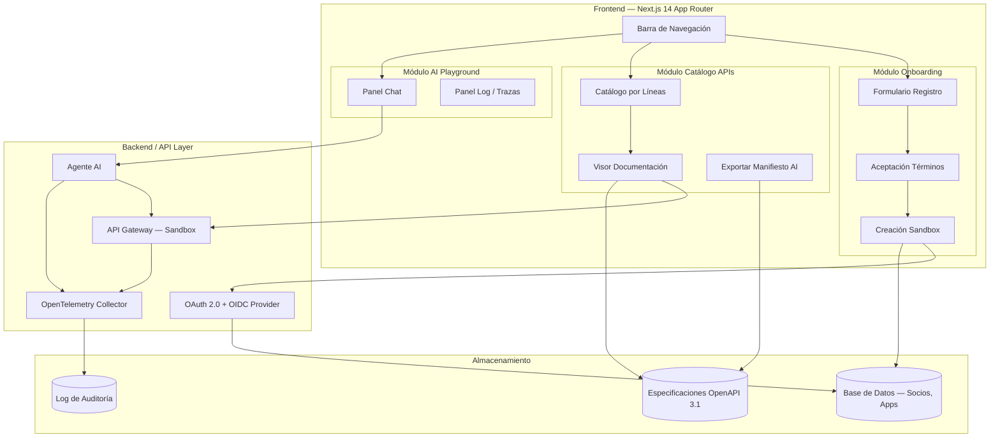
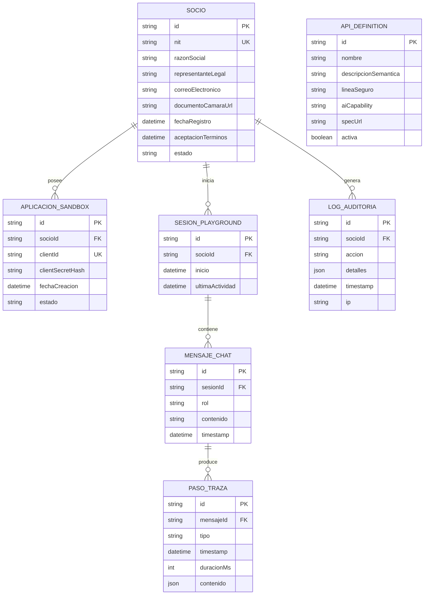

# Documento de Diseño — Bolívar API Developer Portal

## Visión General

El portal de desarrolladores de Seguros Bolívar es una aplicación web construida con Next.js 14 (App Router) que permite a socios externos registrarse, explorar APIs de seguros y experimentar con un playground de inteligencia artificial. La arquitectura sigue un patrón modular con tres módulos principales: Onboarding, Catálogo de APIs y AI Playground, cada uno implementado como un grupo de rutas independiente dentro del App Router.

El diseño prioriza la experiencia del desarrollador (DX) con documentación interactiva, sandbox en tiempo real y un playground de AI que demuestra la capacidad de agentes autónomos para operar las APIs mediante lenguaje natural.

## Arquitectura

### Diagrama de Arquitectura General



### Estructura de Rutas (App Router)

```
app/
├── layout.tsx                    # Layout raíz con NavBar y providers
├── page.tsx                      # Landing / Home
├── onboarding/
│   ├── layout.tsx                # Layout del stepper de onboarding
│   ├── registro/page.tsx         # Paso 1: Formulario de registro
│   ├── terminos/page.tsx         # Paso 2: Aceptación de términos
│   └── sandbox/page.tsx          # Paso 3: Credenciales sandbox
├── catalogo/
│   ├── page.tsx                  # Catálogo con filtros por línea
│   ├── [apiId]/page.tsx          # Visor de documentación interactivo
│   └── manifiesto/route.ts       # API Route para generar manifiesto
├── playground/
│   └── page.tsx                  # AI Playground (chat + log)
└── api/
    ├── auth/[...nextauth]/route.ts  # OAuth 2.0 + OIDC
    ├── sandbox/route.ts             # Creación de app sandbox
    ├── proxy/route.ts               # Proxy al sandbox para peticiones
    └── ai/chat/route.ts             # Endpoint del agente AI
```

### Decisiones de Diseño

1. **App Router de Next.js 14**: Se utiliza el App Router para aprovechar Server Components, streaming y layouts anidados. Los módulos protegidos (catálogo, playground) usan un middleware de autenticación.

2. **Proxy de sandbox en servidor**: Las peticiones al sandbox se enrutan a través de una API Route (`/api/proxy`) para evitar exponer credenciales en el cliente y manejar CORS.

3. **OpenTelemetry en el agente AI**: Las trazas se capturan en el servidor durante la ejecución del agente AI y se envían al cliente vía Server-Sent Events para visualización en tiempo real en el Panel_Log.

4. **Generación de manifiesto en servidor**: El manifiesto AI se genera en una API Route que lee las especificaciones OpenAPI, aplica los filtros activos y retorna el JSON para descarga.

## Componentes e Interfaces

### Componentes Compartidos

```typescript
// components/ui/NavBar.tsx
interface NavBarProps {
  currentModule: 'onboarding' | 'catalogo' | 'playground';
}

// components/ui/CopyToClipboard.tsx
interface CopyToClipboardProps {
  value: string;
  masked?: boolean;        // Ocultar valor por defecto
  revealDuration?: number; // ms para revelación temporal (default: 5000)
  onCopy?: () => void;
  ariaLabel: string;
}

// components/ui/ErrorMessage.tsx
interface ErrorMessageProps {
  message: string;
  fieldId?: string;        // Asociar al campo del formulario
  ariaLive?: 'polite' | 'assertive';
}
```

### Módulo Onboarding

```typescript
// Paso 1: Formulario de Registro
interface RegistroFormData {
  nit: string;              // Formato: 9 dígitos + dígito verificación
  razonSocial: string;
  representanteLegal: string;
  correoElectronico: string;
  documentoCamara: File;    // PDF de Cámara de Comercio
}

interface RegistroFormProps {
  onSubmit: (data: RegistroFormData) => Promise<void>;
  errors: Record<string, string>;
}

// Paso 2: Términos
interface TerminosProps {
  contenidoTerminos: string;  // HTML del texto legal
  onAccept: (timestamp: string) => Promise<void>;
}

// Paso 3: Sandbox
interface SandboxCredentials {
  clientId: string;
  clientSecret: string;
  createdAt: string;
}

interface SandboxConfirmationProps {
  credentials: SandboxCredentials;
  onRetry?: () => Promise<void>;
}
```

### Módulo Catálogo de APIs

```typescript
type LineaSeguro = 'vida' | 'hogar' | 'autos' | 'salud';

interface ApiDefinition {
  id: string;
  nombre: string;
  descripcionSemantica: string;  // Extraída de x-ai-description
  lineaSeguro: LineaSeguro;
  aiCapability: string;          // Extraída de x-ai-capability
  specUrl: string;               // URL a la especificación OpenAPI 3.1
}

interface TarjetaApiProps {
  api: ApiDefinition;
  onClick: (apiId: string) => void;
}

interface CatalogoProps {
  apis: ApiDefinition[];
  filtroActivo: LineaSeguro | 'todas';
  onFiltroChange: (linea: LineaSeguro | 'todas') => void;
}

// Visor de Documentación
interface VisorDocumentacionProps {
  apiSpec: OpenAPISpec;          // Especificación OpenAPI 3.1 parseada
  sandboxCredentials: SandboxCredentials;
}

interface PeticionPrueba {
  method: 'GET' | 'POST' | 'PUT' | 'DELETE' | 'PATCH';
  path: string;
  headers: Record<string, string>;
  body?: unknown;
}

interface RespuestaPrueba {
  statusCode: number;
  headers: Record<string, string>;
  body: unknown;
  durationMs: number;
}
```

### Módulo AI Playground

```typescript
interface MensajeChat {
  id: string;
  rol: 'socio' | 'agente';
  contenido: string;
  timestamp: string;
}

interface PasoTraza {
  id: string;
  tipo: 'interpretacion' | 'peticion' | 'respuesta';
  timestamp: string;
  duracionMs: number;
  contenido: {
    interpretacion?: string;
    endpoint?: string;
    method?: string;
    headers?: Record<string, string>;
    payload?: unknown;
    respuestaJson?: unknown;
    statusCode?: number;
  };
}

interface PanelChatProps {
  mensajes: MensajeChat[];
  onEnviarMensaje: (texto: string) => Promise<void>;
  cargando: boolean;
}

interface PanelLogProps {
  pasos: PasoTraza[];
  pasoExpandido: string | null;
  onExpandirPaso: (pasoId: string) => void;
}
```

### Manifiesto AI

```typescript
// Estructura del manifiesto compatible con GPT-4 Tools
interface ManifiestoAI {
  schema_version: '1.0';
  tools: ManifiestoTool[];
}

interface ManifiestoTool {
  type: 'function';
  function: {
    name: string;
    description: string;       // De x-ai-description
    parameters: JSONSchema;    // Esquema de parámetros del endpoint
    ai_capability: string;     // De x-ai-capability
  };
}
```

## Modelos de Datos

### Diagrama de Entidades



### Validaciones de Datos Clave

| Campo | Regla de Validación |
|-------|-------------------|
| `nit` | Regex: `^\d{9}-\d{1}$` (9 dígitos, guión, 1 dígito de verificación) |
| `correoElectronico` | Formato email válido, dominio corporativo |
| `documentoCamara` | Tipo MIME: `application/pdf`, tamaño máximo: 10 MB |
| `razonSocial` | No vacío, máximo 200 caracteres |
| `representanteLegal` | No vacío, máximo 150 caracteres |
| `clientSecret` | Generado: 256 bits aleatorios, almacenado como hash bcrypt |


## Propiedades de Correctitud

*Una propiedad es una característica o comportamiento que debe mantenerse verdadero en todas las ejecuciones válidas de un sistema — esencialmente, una declaración formal sobre lo que el sistema debe hacer. Las propiedades sirven como puente entre especificaciones legibles por humanos y garantías de correctitud verificables por máquinas.*

### Propiedad 1: Validación de formulario de registro rechaza datos inválidos

*Para cualquier* combinación de datos de formulario de registro donde al menos un campo es vacío o tiene formato inválido, la función de validación SHALL retornar un objeto de errores que contenga un mensaje específico para cada campo inválido, y el número de errores debe ser igual al número de campos inválidos.

**Valida: Requisitos 2.5**

### Propiedad 2: Validación de formato NIT acepta solo el patrón correcto

*Para cualquier* string, la función de validación de NIT SHALL retornar válido si y solo si el string cumple el patrón `^\d{9}-\d{1}$` (9 dígitos, guión, 1 dígito de verificación). Cualquier string que no cumpla este patrón debe ser rechazado.

**Valida: Requisitos 2.6**

### Propiedad 3: Enmascaramiento round-trip de secretos

*Para cualquier* string secreto, aplicar la función de enmascaramiento SHALL producir un resultado que no contenga ningún carácter del string original (excepto el carácter de máscara), y aplicar la función de revelación al mismo string SHALL retornar el valor original sin modificaciones.

**Valida: Requisitos 4.4**

### Propiedad 4: Clasificación y filtrado de APIs por línea de seguro

*Para cualquier* array de ApiDefinition con líneas de seguro asignadas y *para cualquier* filtro de línea seleccionado, la función de filtrado SHALL retornar exactamente las APIs cuya `lineaSeguro` coincide con el filtro, sin omitir ninguna y sin incluir APIs de otras líneas. Cuando el filtro es 'todas', SHALL retornar todas las APIs.

**Valida: Requisitos 5.1, 5.4**

### Propiedad 5: Tarjeta API contiene información requerida

*Para cualquier* ApiDefinition válida, el renderizado de TarjetaApi SHALL producir un output que contenga el nombre de la API, la descripción semántica (x-ai-description) y el indicador de línea de seguro.

**Valida: Requisitos 5.3**

### Propiedad 6: Formateo de respuesta HTTP incluye todos los campos

*Para cualquier* RespuestaPrueba con statusCode, headers y body arbitrarios, la función de formateo SHALL producir un output que incluya el código de estado HTTP, los encabezados de respuesta y el cuerpo JSON.

**Valida: Requisitos 6.3**

### Propiedad 7: Generación de manifiesto AI con filtrado correcto

*Para cualquier* array de ApiDefinition y *para cualquier* filtro de línea activo, la función de generación de manifiesto SHALL producir un JSON con estructura válida de GPT-4 Tools (cada tool con type, function.name, function.description, function.parameters y function.ai_capability) que incluya únicamente las APIs que pasan el filtro activo.

**Valida: Requisitos 7.2, 7.4**

### Propiedad 8: Historial de chat preserva orden y contenido

*Para cualquier* array de MensajeChat, el renderizado del Panel_Chat SHALL mostrar todos los mensajes en el mismo orden en que fueron proporcionados, con el rol y contenido correctos para cada mensaje.

**Valida: Requisitos 8.3**

### Propiedad 9: Renderizado de pasos de traza incluye información completa

*Para cualquier* PasoTraza con tipo, timestamp, duración y contenido arbitrarios, el renderizado del Panel_Log SHALL incluir la marca de tiempo, la duración en milisegundos y las secciones de contenido correspondientes al tipo de paso (interpretación, petición o respuesta).

**Valida: Requisitos 8.5, 9.1**

### Propiedad 10: Expiración de sesión por inactividad

*Para cualquier* par de timestamps (última actividad, momento actual), la función de verificación de sesión SHALL retornar "expirada" si la diferencia es mayor o igual a 15 minutos, y "activa" si la diferencia es menor a 15 minutos.

**Valida: Requisitos 10.4**

## Manejo de Errores

### Estrategia General

| Capa | Tipo de Error | Estrategia |
|------|--------------|------------|
| Formulario de Registro | Validación de campos | Mensajes inline junto a cada campo inválido, usando `aria-live="polite"` para lectores de pantalla |
| Carga de PDF | Archivo inválido/grande | Mensaje descriptivo con formato y tamaño esperados |
| Creación de Sandbox | Fallo de API backend | Mensaje de error con botón de reintento, máximo 3 reintentos automáticos |
| Visor de Documentación | Error de red/timeout | Mensaje con código de error y sugerencia de resolución (verificar conectividad, reintentar) |
| AI Playground | Fallo del agente AI | Mensaje en Panel_Chat indicando que la instrucción no pudo procesarse, con opción de reintentar |
| Autenticación | Token expirado | Redirección silenciosa al flujo de login con mensaje informativo |
| Sesión | Inactividad 15 min | Cierre automático con redirección a login y mensaje de sesión expirada |
| Exportación Manifiesto | Fallo de generación | Toast de error con opción de reintentar |

### Códigos de Error del Sandbox

```typescript
enum SandboxErrorCode {
  NETWORK_ERROR = 'NETWORK_ERROR',
  TIMEOUT = 'TIMEOUT',
  UNAUTHORIZED = 'UNAUTHORIZED',
  RATE_LIMITED = 'RATE_LIMITED',
  INTERNAL_ERROR = 'INTERNAL_ERROR',
}

interface SandboxError {
  code: SandboxErrorCode;
  message: string;
  suggestion: string;
  retryable: boolean;
}

const ERROR_MESSAGES: Record<SandboxErrorCode, SandboxError> = {
  NETWORK_ERROR: {
    code: SandboxErrorCode.NETWORK_ERROR,
    message: 'No se pudo conectar con el sandbox',
    suggestion: 'Verifique su conexión a internet e intente nuevamente',
    retryable: true,
  },
  TIMEOUT: {
    code: SandboxErrorCode.TIMEOUT,
    message: 'La petición al sandbox excedió el tiempo de espera',
    suggestion: 'Intente con una petición más simple o reintente en unos momentos',
    retryable: true,
  },
  UNAUTHORIZED: {
    code: SandboxErrorCode.UNAUTHORIZED,
    message: 'Las credenciales del sandbox no son válidas',
    suggestion: 'Verifique sus credenciales o genere nuevas desde el panel de onboarding',
    retryable: false,
  },
  RATE_LIMITED: {
    code: SandboxErrorCode.RATE_LIMITED,
    message: 'Se ha excedido el límite de peticiones al sandbox',
    suggestion: 'Espere unos minutos antes de realizar más peticiones',
    retryable: true,
  },
  INTERNAL_ERROR: {
    code: SandboxErrorCode.INTERNAL_ERROR,
    message: 'Error interno del sandbox',
    suggestion: 'Intente nuevamente. Si el problema persiste, contacte soporte',
    retryable: true,
  },
};
```

## Estrategia de Testing

### Enfoque Dual

El portal utiliza un enfoque dual de testing:

- **Tests unitarios (ejemplo)**: Verifican comportamientos específicos, casos borde y condiciones de error con ejemplos concretos.
- **Tests de propiedades (PBT)**: Verifican propiedades universales que deben cumplirse para todas las entradas válidas, usando generación aleatoria de datos.

Ambos enfoques son complementarios: los tests unitarios capturan bugs concretos y los tests de propiedades verifican correctitud general.

### Librería de Property-Based Testing

Se utilizará **fast-check** como librería de PBT para TypeScript/JavaScript, integrada con Vitest.

```bash
npm install --save-dev fast-check
```

### Configuración de Tests de Propiedades

- Mínimo **100 iteraciones** por test de propiedad
- Cada test debe referenciar la propiedad del documento de diseño
- Formato de tag: `Feature: bolivar-api-developer-portal, Property {número}: {texto}`

### Distribución de Tests

| Módulo | Tests Unitarios | Tests de Propiedades | Tests de Integración |
|--------|----------------|---------------------|---------------------|
| Onboarding — Registro | Renderizado de formulario, campos, labels, aria | Validación de formulario (P1), Validación NIT (P2) | — |
| Onboarding — Términos | Checkbox, botón deshabilitado, navegación | — | — |
| Onboarding — Sandbox | Mostrar credenciales, copiar, error/reintento | Enmascaramiento de secretos (P3) | Creación de sandbox |
| Catálogo APIs | Renderizado de secciones, navegación, botón manifiesto | Filtrado APIs (P4), Tarjeta API (P5), Manifiesto AI (P7) | — |
| Visor Documentación | Renderizado de spec, credenciales precargadas, errores | Formateo respuesta HTTP (P6) | Peticiones al sandbox |
| AI Playground | Layout paneles, input, credenciales | Historial chat (P8), Pasos traza (P9) | Agente AI |
| Seguridad | Enmascaramiento, redirección login | Expiración sesión (P10) | OAuth 2.0/OIDC |
| Accesibilidad | Navegación teclado, contraste, aria-labels, semántica HTML | — | — |

### Tests de Accesibilidad

- Verificación de contraste 4.5:1 con las combinaciones de colores del portal
- Navegación completa por teclado en cada módulo
- Presencia de `aria-label` en todos los campos de formulario
- Atributo `aria-live="polite"` en contenedores de mensajes de error/confirmación
- Estructura semántica con `h2`/`h3` en el catálogo

### Tests de Integración

- Flujo completo de onboarding (registro → términos → sandbox)
- Peticiones al sandbox desde el Visor de Documentación
- Interacción con el agente AI en el Playground
- Flujo de autenticación OAuth 2.0/OIDC
- Registro de acciones en log de auditoría
