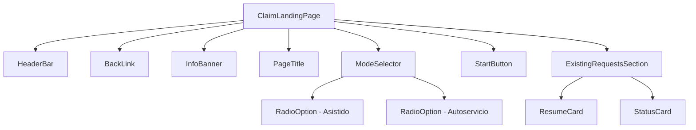
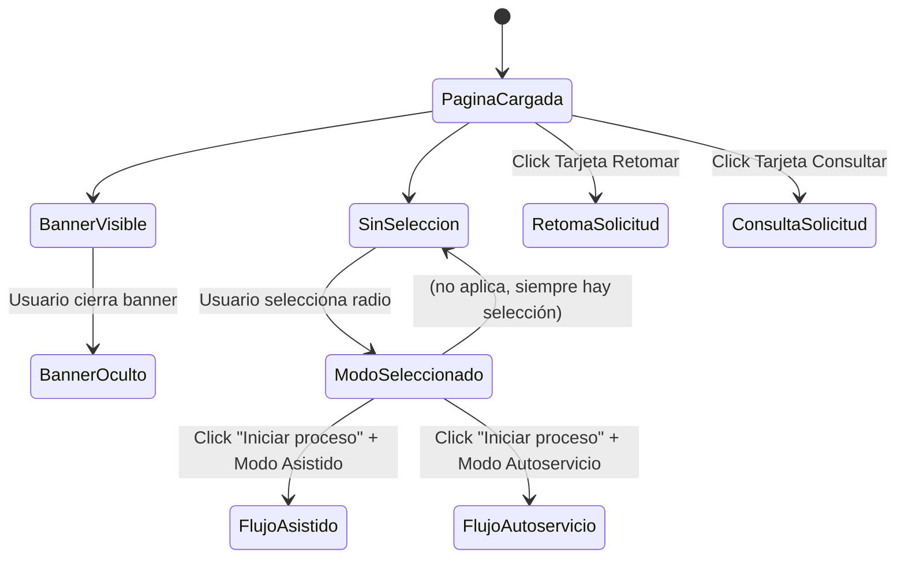

# Documento de Diseño: Insurance Claim Landing

## Resumen

Este documento describe el diseño técnico de la página de aterrizaje (landing page) para reclamaciones de seguros de Seguros Bolívar, accesible a través de Banco Davivienda. La página permite a los usuarios iniciar una nueva reclamación (con asistente IA o autoservicio), retomar solicitudes pendientes y consultar el estado de solicitudes existentes.

La solución se implementará como una aplicación React con TypeScript, utilizando componentes funcionales y hooks para el manejo de estado. Se priorizará la accesibilidad (WCAG 2.1 AA), la responsividad y la coherencia con la identidad visual de Davivienda.

## Arquitectura

### Stack Tecnológico

- **Framework**: React 18+ con TypeScript
- **Estilos**: CSS Modules para encapsulamiento de estilos por componente
- **Enrutamiento**: React Router v6 para navegación entre flujos
- **Estado**: Estado local con `useState` y `useReducer` (no se requiere estado global para esta landing page)
- **Testing**: Vitest + React Testing Library + @testing-library/user-event

### Diagrama de Componentes



### Flujo de Interacción



## Componentes e Interfaces

### ClaimLandingPage (Componente raíz)

Componente contenedor que orquesta el layout y el estado de la página.

```typescript
interface ClaimLandingPageState {
  selectedMode: ClaimMode | null;
  isBannerVisible: boolean;
}

type ClaimMode = 'assisted' | 'self-service';
```

**Responsabilidades:**
- Gestionar el estado de selección de modalidad
- Gestionar la visibilidad del banner informativo
- Coordinar la navegación al flujo correspondiente

### HeaderBar

Barra superior roja con el logotipo de Davivienda.

```typescript
interface HeaderBarProps {
  logoSrc: string;
  logoAlt: string;
}
```

### BackLink

Enlace de navegación "Volver" con ícono de flecha.

```typescript
interface BackLinkProps {
  href: string;
  label?: string; // default: "Volver"
}
```

### InfoBanner

Banner de consejos con enlace "Ver requisitos" y botón de cierre.

```typescript
interface InfoBannerProps {
  isVisible: boolean;
  onClose: () => void;
  onViewRequirements: () => void;
  title: string;
  requirementsLinkText: string;
}
```

### ModeSelector

Selector de modalidad con dos opciones tipo radio.

```typescript
interface ModeSelectorProps {
  selectedMode: ClaimMode | null;
  onSelectMode: (mode: ClaimMode) => void;
  options: RadioOptionConfig[];
}

interface RadioOptionConfig {
  id: ClaimMode;
  title: string;
  description: string;
  badge?: string; // Ej: "Inteligencia artificial"
}
```

**Atributos ARIA:**
- Contenedor: `role="radiogroup"`, `aria-labelledby`
- Cada opción: `role="radio"`, `aria-checked`, `tabIndex`

### StartButton

Botón principal "Iniciar proceso".

```typescript
interface StartButtonProps {
  isEnabled: boolean;
  onClick: () => void;
  label?: string; // default: "Iniciar proceso"
}
```

**Atributos ARIA:**
- `aria-disabled` refleja el estado `isEnabled`

### ActionCard

Componente reutilizable para Tarjeta_Retomar y Tarjeta_Consultar.

```typescript
interface ActionCardProps {
  title: string;
  description: string;
  iconSrc: string;
  iconAlt: string;
  onClick: () => void;
}
```

## Modelos de Datos

### Estado de la Página

```typescript
interface LandingPageState {
  selectedMode: ClaimMode | null;
  isBannerVisible: boolean;
}

type ClaimMode = 'assisted' | 'self-service';
```

### Configuración de Opciones de Modalidad

```typescript
const MODE_OPTIONS: RadioOptionConfig[] = [
  {
    id: 'assisted',
    title: 'Con ayuda de un asistente IA',
    description: 'Un par de preguntas para entender lo ocurrido.',
    badge: 'Inteligencia artificial',
  },
  {
    id: 'self-service',
    title: 'Continuar sin ayuda',
    description: 'Prefiero completar el reporte por mi cuenta.',
  },
];
```

### Rutas de Navegación

```typescript
const ROUTES = {
  assistedFlow: '/claims/assisted',
  selfServiceFlow: '/claims/self-service',
  resumeRequest: '/claims/resume',
  checkStatus: '/claims/status',
  back: '/home',
  requirements: '/claims/requirements',
} as const;
```

### Tokens de Diseño

```typescript
const DESIGN_TOKENS = {
  colors: {
    primary: '#ED1C27',       // Rojo Davivienda
    primaryDark: '#C8151F',   // Hover del rojo
    white: '#FFFFFF',
    textPrimary: '#1A1A1A',
    textSecondary: '#4A4A4A',
    background: '#F5F5F5',
    border: '#E0E0E0',
    disabled: '#CCCCCC',
  },
  breakpoints: {
    mobile: 768,
    desktop: 1024,
  },
  typography: {
    minFontSize: 14,          // px, para móviles
  },
  layout: {
    maxContentWidth: 720,     // px, ancho máximo del contenedor
  },
} as const;
```

## Manejo de Errores

### Errores de Navegación

| Escenario | Comportamiento |
|-----------|---------------|
| Ruta de flujo asistido no disponible | Mostrar mensaje de error genérico y mantener al usuario en la landing page |
| Ruta de flujo autoservicio no disponible | Mostrar mensaje de error genérico y mantener al usuario en la landing page |
| Enlace "Volver" apunta a ruta inválida | Redirigir a la página principal (`/home`) |

### Errores de Estado

| Escenario | Comportamiento |
|-----------|---------------|
| Click en Boton_Iniciar sin modo seleccionado | El botón permanece deshabilitado; no se ejecuta ninguna acción. Se previene mediante `aria-disabled` y lógica de `onClick` condicional |
| Banner ya cerrado y se intenta cerrar de nuevo | No-op; el estado `isBannerVisible` ya es `false` |

### Errores de Carga

| Escenario | Comportamiento |
|-----------|---------------|
| Imagen del logotipo no carga | Mostrar texto alternativo (`alt`) del logotipo |
| Íconos de tarjetas no cargan | Mostrar texto alternativo (`alt`) de los íconos |

## Estrategia de Testing

### Justificación: No se aplican Property-Based Tests

Esta funcionalidad es una página de aterrizaje (landing page) de UI con las siguientes características:

- **Renderizado estático**: La mayoría de los criterios verifican la presencia de elementos y textos específicos en el DOM.
- **Espacio de entrada mínimo**: El selector de modalidad tiene solo 2 opciones; el banner tiene un solo botón de cierre. No hay un espacio de entrada amplio que justifique 100+ iteraciones.
- **Comportamiento determinista**: Las transiciones de estado son simples (seleccionar/deseleccionar, mostrar/ocultar) sin transformaciones de datos.
- **Sin lógica pura compleja**: No hay parsers, serializadores, algoritmos ni transformaciones de datos que se beneficien de PBT.

Por estas razones, se omite la sección de Propiedades de Correctitud y se utiliza exclusivamente testing basado en ejemplos.

### Herramientas

- **Vitest**: Test runner
- **React Testing Library**: Renderizado y consultas de componentes
- **@testing-library/user-event**: Simulación de interacciones de usuario

### Plan de Tests

#### Tests Unitarios por Componente

**HeaderBar**
- Renderiza el logotipo con el atributo `alt` correcto
- Aplica fondo rojo (#ED1C27)

**BackLink**
- Renderiza el texto "Volver" con ícono de flecha
- Navega a la ruta correcta al hacer click

**InfoBanner**
- Renderiza el texto "Consejos para hacer su reporte más rápido"
- Renderiza el enlace "Ver requisitos"
- Renderiza el botón de cierre
- Se oculta al presionar el botón de cierre
- Tiene `role="alert"` o `role="status"`

**ModeSelector**
- Renderiza las dos opciones con títulos y descripciones correctos
- Muestra la insignia "Inteligencia artificial" en la primera opción
- Resalta visualmente la opción seleccionada
- Solo permite una opción seleccionada a la vez
- Tiene `role="radiogroup"` en el contenedor
- Tiene `role="radio"` en cada opción
- Soporta navegación por teclado (Tab, flechas, Enter/Space)

**StartButton**
- Renderiza el texto "Iniciar proceso"
- Está deshabilitado cuando no hay modo seleccionado
- Se habilita al seleccionar un modo
- Tiene `aria-disabled="true"` cuando está deshabilitado
- Tiene `aria-disabled="false"` cuando está habilitado

**ActionCard (Tarjeta_Retomar y Tarjeta_Consultar)**
- Renderiza título, descripción, ícono y flecha de navegación
- Navega a la ruta correcta al hacer click
- Es activable mediante teclado

#### Tests de Integración (ClaimLandingPage)

- Renderiza todos los componentes en el orden correcto
- Flujo completo: seleccionar modo asistido → click "Iniciar proceso" → navega a flujo asistido
- Flujo completo: seleccionar modo autoservicio → click "Iniciar proceso" → navega a flujo autoservicio
- Cerrar banner → banner desaparece → resto de la página no se afecta
- Botón deshabilitado no navega al hacer click

#### Tests de Responsividad

- Layout se adapta correctamente a viewport de escritorio (≥1024px)
- Layout se adapta correctamente a viewport móvil (<768px)
- Tamaño mínimo de fuente de 14px en móvil

#### Tests de Accesibilidad (Smoke)

- Contraste de colores cumple ratio 4.5:1 (verificación manual o con herramienta axe-core)
- Navegación completa por teclado sin trampas de foco
- Todos los elementos interactivos tienen nombres accesibles
